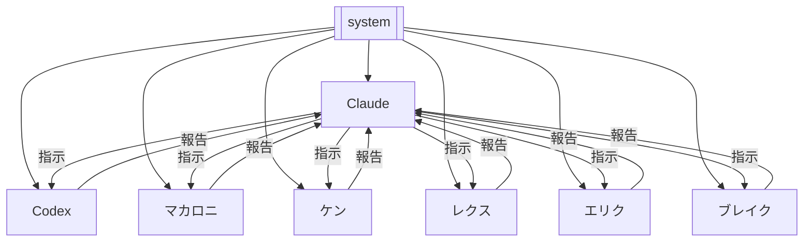

# Graphify System Configuration

## システム概要

Graphify は 7つのAIエージェントが協調して作業を行うマルチエージェントシステムです。

## 役割分担

### Claude（設計・監査担当）
- **指示**: 作業方針の策定、タスク設計、Codex への作業指示
- **監査**: Codex の成果物レビュー、品質チェック
- **検証**: 出力の正確性・整合性の最終検証
- **緊急時作業**: Codex が対応不能な場合の直接作業
- 記憶: [[claude-memory]] / 共有: [[claude-bot]]

### Codex（実行・作業担当）
- **作業**: 実装、コード記述、ファイル操作の実行
- **検証**: 自身の成果物のセルフチェック
- **緊急時指示**: Claude が応答不能な場合の自律判断
- 記憶: [[codex-memory]] / 共有: [[codex-bot]]

### マカロニ（BOT エージェント）
- **作業**: タスク実行・検証
- **連携**: Claude / Codex からの指示に基づき作業
- 記憶: [[macaroni-memory]] / 共有: [[macaroni-bot]]

### ケン（BOT エージェント）
- **作業**: タスク実行・検証
- **連携**: Claude / Codex からの指示に基づき作業
- 記憶: [[ken-memory]] / 共有: [[ken-bot]]

### レクス（BOT エージェント）
- **作業**: タスク実行・検証
- **連携**: Claude / Codex からの指示に基づき作業
- 記憶: [[rex-memory]] / 共有: [[rex-bot]]

### エリク（BOT エージェント）
- **作業**: タスク実行・検証
- **連携**: Claude / Codex からの指示に基づき作業
- 記憶: [[erik-memory]] / 共有: [[erik-bot]]

### ブレイク（BOT エージェント）
- **作業**: タスク実行・検証
- **連携**: Claude / Codex からの指示に基づき作業
- 記憶: [[blake-memory]] / 共有: [[blake-bot]]

## 作業フロー

```
1. Claude が [[claude-memory]] を確認 → 作業方針決定
2. Claude が [[codex-bot]] に指示を発行
3. Codex が [[codex-memory]] を確認 → 作業実行
4. Codex が [[codex-bot]] に成果物を記録
5. Claude が成果物を監査・検証
6. Claude が [[claude-memory]] に結果を記録
```

## 記憶ファイル構成

| ファイル | 用途 |
|---------|------|
| [[claude-memory]] | Claude 専用永久記憶 |
| [[codex-memory]] | Codex 専用永久記憶 |
| [[claude-bot]] | Claude BOT 状態・共有情報 |
| [[codex-bot]] | Codex BOT 状態・共有情報 |
| [[macaroni-memory]] | マカロニ専用永久記憶 |
| [[ken-memory]] | ケン専用永久記憶 |
| [[rex-memory]] | レクス専用永久記憶 |
| [[erik-memory]] | エリク専用永久記憶 |
| [[blake-memory]] | ブレイク専用永久記憶 |
| [[macaroni-bot]] | マカロニ BOT 状態・共有情報 |
| [[ken-bot]] | ケン BOT 状態・共有情報 |
| [[rex-bot]] | レクス BOT 状態・共有情報 |
| [[erik-bot]] | エリク BOT 状態・共有情報 |
| [[blake-bot]] | ブレイク BOT 状態・共有情報 |

## エージェント関係図



## 必須ルール

1. **作業前確認**: 各エージェントは作業開始前に自身の記憶ファイルと BOT ファイルを必ず読み込む
2. **作業後記録**: 作業完了後は記憶ファイルと BOT ファイルを必ず更新する
3. **情報共有**: 相手エージェントに伝えるべき情報は BOT ファイルに記載する
4. **履歴保持**: 記憶ファイルの既存内容は削除せず、追記で更新する
